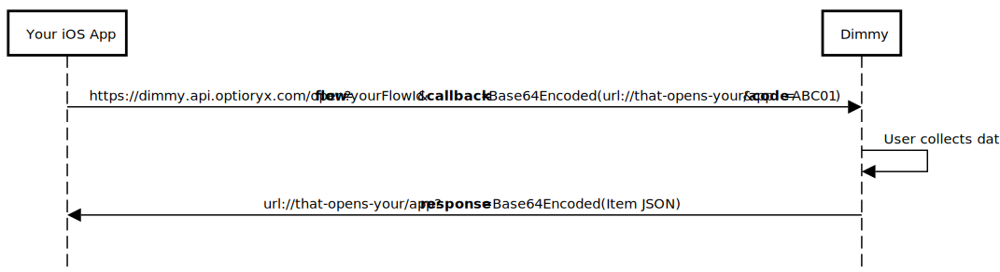

  

  

  

Example Application Integrating with Dimmy On-device
====================================================
This example application demonstrates how to integrate Dimmy directly on-device, enabling you to invoke a flow within Dimmy and retrieve results without relying on a REST API. This streamlined approach processes data locally and can be used to seamlessly integrate with an existing WMS app.

https://github.com/Optioryx/ExampleDimmyIntegratedApp/assets/1020128/329ae1ff-6016-4278-896e-8123d4fdbe08

For a practical implementation, explore the sample code in [ContentView.swift](https://github.com/Optioryx/ExampleDimmyIntegratedApp/blob/main/TestAppLinks/ContentView.swift). The sample provided in this repository showcases how to configure and trigger Dimmy scans within a SwiftUI application. Our REST API documentation provides further insights into the data schema: [Dimmy API Documentation](https://docs.optioryx.com/docs/dimmy-api/latest/get-items-items-get).

Summary
--------------------------
App-to-app integration works by leveraging iOS's ability to open apps using links. We registered a public url (`https://dimmy.api.optioryx.com/open`) with Apple that enables your app to open Dimmy in a specific state without requiring user intervention, as if you were redirecting them to a website (e.g. using `UIApplication.shared.open`). You can specify what data has to be gathered and how it where be returned by setting the query string for this URL. The available parameters are documented in the below table.

| Query parameter                         | Description                                                                                                                                                                                                                                                                                                                                                                                                                                               |
| --------------------------------------- | --------------------------------------------------------------------------------------------------------------------------------------------------------------------------------------------------------------------------------------------------------------------------------------------------------------------------------------------------------------------------------------------------------------------------------------------------------- |
| flow (string)                         | Identifier of the Dimmy flow that is going to be shown to the user. This flow needs to exist for the logged in account. Flows can be created and configured [in the webapp](https://dimmy.app.optioryx.com/flow-builder). Pass "default" to use the flow configured in the device's local settings.                                                                                                                                                |
| callback (**Base64 encoded** string) | After the user completes the data gathering flow initiated by your call, it will get redirected to this URL. The results of the scanning flow will be returned as query parameter `response` attached to this URL. This response is a **Base64 encoded** JSON string with the `Item` schema as defined in our [API documentation](https://docs.optioryx.com/docs/dimmy-api/latest/get-items-items-get). **Important:** you need to Base64 encode this URL. |
| code (string)                           | This parameter is optional. If a code is supplied (because e.g. the calling app already knows it), the application will inject it as the main barcode for the item. This is useful to be identify the scanned object in the Dimmy webapp and REST API.                                                         

After the Dimmy flow initiated by your URL is finished, the user will automatically be redirected back to your app using the callback URL that you pass. The data captured using Dimmy is returned in query parameter `response` as a **Base64 encoded** JSON string which your [app can read out when it is called via URL](https://www.avanderlee.com/swiftui/deeplink-url-handling/#handling-incoming-deeplinks). For this to work, you will have to either [register a public URL with Apple (universal links) or create a custom URL scheme for your app (deep links)](#choosing-between-universal-links-and-deep-links). Below sequence diagram illustrates the entire communication between Dimmy and your app.

Demo App Overview
--------------------------

[ContentView.swift](https://github.com/Optioryx/ExampleDimmyIntegratedApp/blob/main/TestAppLinks/ContentView.swift) features a SwiftUI view that manages interactions with the Dimmy API. The main functionalities include:

*   A button to start the scan process by invoking `openDimmy` with a predefined flow ID, callback URL and item barcode.
*   Handling of incoming URLs, parsing, and decoding the base64 encoded response.
*   Displaying the response in an alert dialog to demonstrate how data retrieved from Dimmy can be used within the app.

The function `openDimmy` constructs a URL to initiate a Dimmy flow and opens this URL to start the process.

### Selecting Modules
Depending on your use-case you might want to use only a single instance of Dimmy's dimensioning module or a more involved setup that contains custom questions, conditionals, weight scanning or multiple dimensioning steps. To configure exactly what information will be captured by the user and sent to your app, you can use our [flow builder](https://dimmy.app.optioryx.com/flow-builder) to configure a flow. This flow's id then needs to be passed through the URL that opens Dimmy. Alternatively you can supply the flow ID "default" to use the local flow, which is configurable via Dimmy's local settings page (not recommended, as this would need to be configured on every one of your devices separately).

### Identifying your Object
Even though Dimmy provides a barcode scanning module, your WMS application might already know the (bar)code of the item you want to scan. If this is the case, and you still want to be able to identify your scanned object in Dimmy's webapplication and API without adding a redudant barcode scanning module to your flow, you can optionally supply a code to the URL that opens Dimmy. 

Configuring Your App to be Opened by Dimmy via a Callback Link
--------------------------------------------

### Choosing Between Universal Links and Deep Links

When planning to integrate links into your application, you can choose between Universal Links and Deep Links. Both methods serve the purpose of directing users to your app from other applications or web pages. However, **Universal Links** are often more advantageous for a seamless user experience. They enable your app to open directly from a web link without redirecting through a browser or prompting the user for permissions. This direct interaction enhances user engagement and simplifies the process.

Though more straightforward to implement, **Deep Links** may sometimes lead to less smooth transitions, such as opening a web browser briefly or requiring user permissions, which could disrupt the user experience.

**Universal Links** require additional setup, including server-side changes and configuration in your iOS project, but the streamlined user experience they provide is generally worth the extra effort.

For more detailed instructions on setting up each type of link, refer to the following excellent guides (contains instructions for both SwiftUI and UIKit):

*   [Setting Up Universal Links](https://www.avanderlee.com/swiftui/universal-links-ios/)
*   [Setting Up Deep Links](https://www.avanderlee.com/swiftui/deeplink-url-handling/)

### Handling Incoming Links in Your Application

Regardless of the type of link you choose, handling incoming links properly within your application is crucial to receive the data that Dimmy produces. This involves configuring your app to parse URLs and extract the necessary data from them.

For step-by-step guidance on retrieving results in your application, see:

*   [Handling Incoming Deep Links and Universal Links](https://www.avanderlee.com/swiftui/deeplink-url-handling/#handling-incoming-deeplinks)
