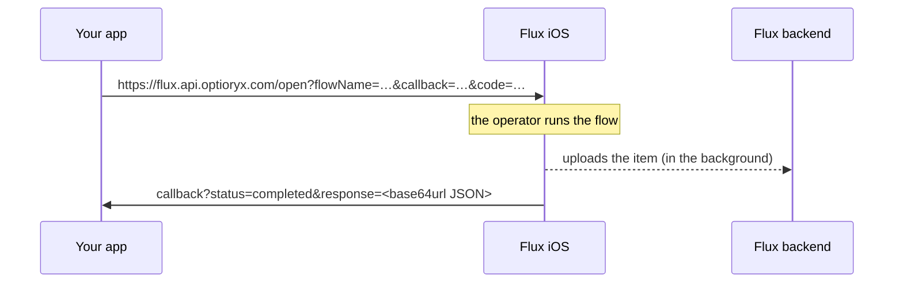

<br/><br/><p align="center">
  
</p><br/><br/>

Integrating Flux into your iOS app
==================================

This example shows how your own iOS app (for example a WMS app) can open a [Flux](https://flux.optioryx.com) flow on the same iPhone, let the operator capture data (dimensions, photos, barcodes, weights, answers), and get the captured data back. No REST API is needed: the two apps talk to each other through links.

Flux was formerly called Dimmy. This integration is available on **iOS only**; Android is not supported yet.

- [Requirements](#requirements)
- [Quick start](#quick-start)
- [The link contract](#the-link-contract)
- [Receiving the result in your app](#receiving-the-result-in-your-app)
- [Reading the data](#reading-the-data)
- [Known limits](#known-limits)
- [How it works](#how-it-works)
- [Upgrading from the 2024 version](#upgrading-from-the-2024-version)

Requirements
------------

- **Flux for iOS <!-- MIN_FLUX_VERSION: fill in at release -->** or later, installed on the same iPhone as your app.
- An operator **logged into Flux** on that iPhone.
- The **name** of the flow to run, built in the [Flux web app](https://flux.optioryx.com). To go straight to measuring, make a flow with just one dimensioning step.
- Xcode 26 to build this example.

Quick start
-----------

1. Open `FluxIntegrationExample.xcodeproj` in Xcode. Under *Signing & Capabilities*, pick your own team (and change the bundle id if Xcode asks).
2. Run the app on an iPhone that has Flux installed and logged in. The simulator cannot run Flux.
3. Type your flow's name exactly as in the web app, optionally type a barcode, and tap **Start scan in Flux**. Run the flow in Flux; when you finish it, Flux switches back to the example and shows the result.

To use this in your own app, copy [`FluxLink.swift`](FluxIntegrationExample/FluxLink.swift) into it. It has no dependencies and does all the encoding for you. [`ContentView.swift`](FluxIntegrationExample/ContentView.swift) shows how to call it.

The link contract
-----------------

### Opening Flux

Your app opens this link with `UIApplication.shared.open(_:)` (or SwiftUI's `openURL`). iOS hands it straight to Flux.

```
https://flux.api.optioryx.com/open?flowName=<flow name>&callback=<your URL>&code=<barcode>
```

| Parameter | Required | Meaning |
|---|---|---|
| `flowName` | yes | The name of the flow to run, exactly as in the Flux web app (upper and lower case matter). |
| `callback` | no | The URL Flux opens when it is done, as a normal URL in the query (percent-encoded, as every URL library does for you). Without it, the flow ends on Flux's own end screen and your app gets nothing back. |
| `code` | no | A barcode your app already knows, for example the order or SKU being measured. Flux stores it on the captured item so you can find the item later in the Flux web app and API. It does not skip or fill in a barcode step of the flow. |

`FluxLink.openURL(flowName:callback:code:)` builds this link for you.

### The result

Flux opens your `callback` URL with these query parameters added. Any query your callback already has is kept, so you can put your own context in it (for example `myapp://flux-result?order=4711`).

| Outcome | Parameters added |
|---|---|
| The operator finished the flow | `status=completed&response=<data>` |
| The operator left the flow without finishing it | `status=cancelled` |
| The flow could not start | `status=error&error=<reason>` |

Error reasons:

| `error` | Meaning |
|---|---|
| `invalid_request` | The link has no `flowName`. (If `callback` itself is not a valid URL, Flux cannot answer at all.) |
| `not_logged_in` | Nobody is logged into Flux on this iPhone. Ask the operator to log in and try again. |
| `flow_unavailable` | Flux does not know this flow: a typo in the name, a flow of another account, a flow with no steps, or a flow that needs a newer Flux version. |

`response` is the captured item as JSON, encoded as **base64url** (Base64 with `-` and `_` instead of `+` and `/`, and no `=` padding, so it survives inside a URL unchanged). `FluxLink.Result(url:)` decodes it:

```swift
.onOpenURL { url in
    switch FluxLink.Result(url: url) {
    case .completed(let json): handle(json)          // the captured item
    case .cancelled:           showCancelled()
    case .error(let reason):   showError(reason)     // e.g. "not_logged_in"
    case nil:                  break                 // not a Flux callback
    }
}
```

Receiving the result in your app
--------------------------------

Your app needs a URL that iOS opens in your app. There are two ways.

**A custom URL scheme** (what this example does). Register a scheme in your app's `Info.plist` under `CFBundleURLTypes` (see [`Info.plist`](FluxIntegrationExample/Info.plist), which registers `fluxexample`) and pass a callback like `fluxexample://result`. Handle it with `.onOpenURL` in SwiftUI, or `scene(_:openURLContexts:)` in a UIKit scene delegate. It needs no server, but any app can register the same scheme, so pick a name that is unique to you.

**A universal link** (recommended for production). A normal `https://` URL on a domain you own, which iOS opens in your app. It cannot be claimed by another app, but needs an `apple-app-site-association` file on your domain and the *Associated Domains* capability in your app. See Apple's guide: [Supporting universal links in your app](https://developer.apple.com/documentation/xcode/supporting-universal-links-in-your-app). Handle it with `.onOpenURL` in SwiftUI, or `scene(_:continue:)` in UIKit.

Reading the data
----------------

`response` holds the captured item in Flux's mobile format: one list per kind of step (`dimensioning`, `photographing`, `barcodeScanning`, `weighing`, `customInputs`, and so on), each entry tagged with the `flowStepId` of the step that produced it, plus `startedAt` and `endedAt`. Print it once for your flow (the example shows it on screen) and pick the fields you need.

`FluxLink.dimensions(in:)` shows how to read the first measured box:

```swift
if let box = FluxLink.dimensions(in: json) {
    print(box.width, box.height, box.depth, box.unit)
}
```

Good to know:

- **Photos** are links, not images. They may still be uploading when your app gets the result.
- The item is also uploaded to Flux as usual, so it appears in the Flux web app and API (and any webhooks you set up). The result does not include the item's id: to find the stored item later, search for the `code` you passed.

Known limits
------------

- **Renaming a flow** in the web app breaks every link that uses its old name. Give integration flows a name you will keep.
- If two flows have the **same name**, Flux opens one of them. Keep integration flow names unique.
- Photos may still be uploading when the result arrives.
- Signatures are included as image data, which makes the result URL large.
- If the operator **pauses** a flow that your app started, your app gets no result for it.
- If a second link arrives while a flow started by a link is still open, the first flow is dropped and its app gets no result.
- iOS only.

How it works
------------


```mermaid
sequenceDiagram
    participant App as Your app
    participant Flux as Flux iOS
    participant API as Flux backend
    App->>Flux: https://flux.api.optioryx.com/open?flowName=…&callback=…&code=…
    Note over Flux: the operator runs the flow
    Flux-->>API: uploads the item (in the background)
    Flux->>App: callback?status=completed&response=<base64url JSON>
```

The `https://flux.api.optioryx.com/open` link is a universal link: Flux has claimed that address with Apple, so iOS opens Flux directly instead of the browser.

Upgrading from the 2024 version
-------------------------------

The 2024 version of this example used an older link format that current Flux versions no longer accept.

| 2024 | Now |
|---|---|
| `https://dimmy.api.optioryx.com/open` | `https://flux.api.optioryx.com/open` |
| `flow=<flow name>`, or `flow=default` | `flowName=<flow name>` (no `default`) |
| `callback` Base64-encoded | `callback` as a normal (percent-encoded) URL |
| Only a `response` on success; nothing on cancel or error | Always a `status`; `response` on success |
| `response` in standard Base64 | `response` in base64url |
